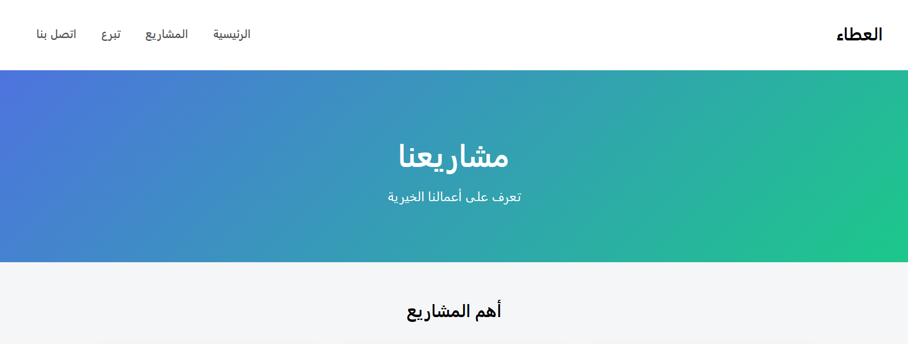
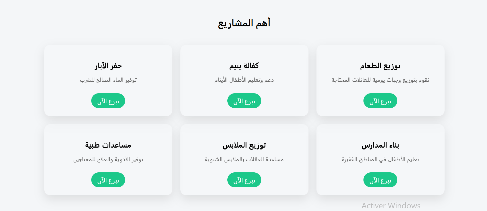
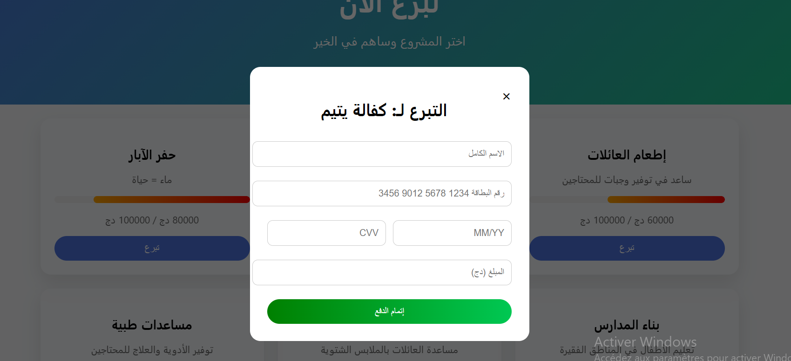

# Attaa - Donation Website ❤️

Plateforme web dédiée à la collecte de dons en ligne, permettant aux utilisateurs de soutenir différents projets solidaires de manière simple et sécurisée.

## 🔧 Technologies

HTML, CSS, JavaScript, PHP

## ✨ Fonctionnalités

* Système de don en ligne
* Présentation des المشاريع الخيرية
* Interface simple et intuitive
* Formulaire de contact

## 📌 Description

Ce projet a été conçu pour faciliter la participation aux actions solidaires en ligne, avec une interface claire et accessible pour tous les utilisateurs.

## 🚧 État du projet

Projet en cours de développement et d’amélioration.

